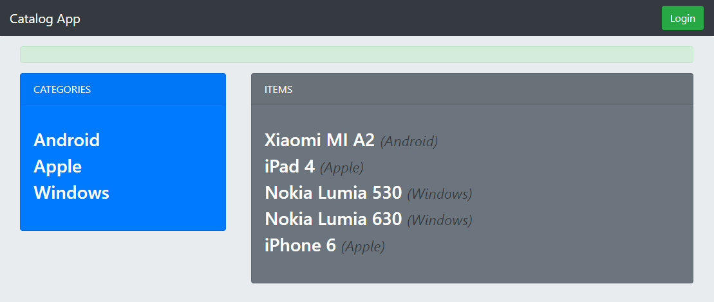

# Buid an Item Catalog Application
## Project Overview
> This project describe that, how to develop an application that provides a list of items within a variety of categories as well as provide a user registration and authentication system. Registered users will have the ability to post, edit and delete their own items.

## How to Run? :traffic_light:
### Pre Requirements!
* [Git 2.18.0](https://git-scm.com/) Version Control System
* [Python 2.7.12](https://www.python.org/downloads/windows/) High-Level Programming Language
* [Vagrant 2.1.2](https://www.vagrantup.com/) Build and Maintain Virtual Machine
* [VirtualBox 5.1.38](https://www.virtualbox.org/wiki/Download_Old_Builds_5_1) Execute the Virtual Machine
* Flask Framework (Pre-installed in Virtual Machine)
* Bootstrap 4.1.3 (Required Proper Inrernet Connection)

### Setup the Project:
1. Install Git.
2. Install Vagrant and VirtualBox.
3. Python and PostgreSQL are already pre-installed in VM.
4. Download or Clone [fullstack-nanodegree-vm](https://github.com/udacity/fullstack-nanodegree-vm) repository.
5. Download or Clone [Buid an Item Catalog Application](https://github.com/FixEight/udacity-buid-an-item-catalog-application.git) repository.
6. You will need to unzip repository after downloading it or open it after cloning. Move all the content of the cloning/downloaded folder in (New Folder) whose name is **catalog** and move this **catalog** folder inside **vagrant** sub-directory in the downloaded **fullstack-nanodegree-vm**.

### Start the Virtual Machine:
The VM is a Linux server system that runs on top of your own computer. You can share files easily between your compute. Launch the VM inside **vagrant** sub-directory in the downloaded **fullstack-nanodegree-vm** repository using command in terminal/Git Bash:
```
    $ vagrant up
```
log in VM using command in terminal/Git Bash:
```
    $ vagrant ssh
```
After log in VM, change directory `cd` to /vagrant and look around with `ls`. Then you will get Shell Prompt look like this:
```
    vagrant@vagrant:/vagrant$
```
After in vagrant directory, change directory `cd` to /catalog and look around with `ls`. Then you will get Shell Prompt look like this:
```
    vagrant@vagrant:/vagrant/catalog$
```
### Setup the Database:
After in catalog directory in VM. Create database using the command:
```
    $ python database_setup.py
```
After creating database populate it with dummy data by using this command:
```
    $ python lotsofitems.py
```
## Run the Project: :rocket:
Inside **vagrant/catalog** sub-directory run the `project.py` file using the command:
```
    $ python project.py
```
After this open your favourite **Browser** and then type this address in address bar:
```
    http://localhost:8000/catalog/
```
## For JSON Endpoints:
Try these links to access public JSON Endpoints.

**Return the JSON objects of all categories and items:**
```
    http://localhost:8000/catalog/JSON
```
**Return the JSON objects of items of specific category:**
```
    http://localhost:8000/catalog/<int:categories_id>/JSON
```
**Return the JSON objects of specific item:**
```
    http://localhost:8000/catalog/<int:categories_id>/<int:itemID>/JSON
```
## Expected Output in Browser: :camel:

## License
Buid an Item Catalog Application is Copyright :copyright: 2018 Kashif Iqbal. It is free, and may be redistributed under the terms specified in the [LICENSE](https://choosealicense.com/licenses/mit/#) file.